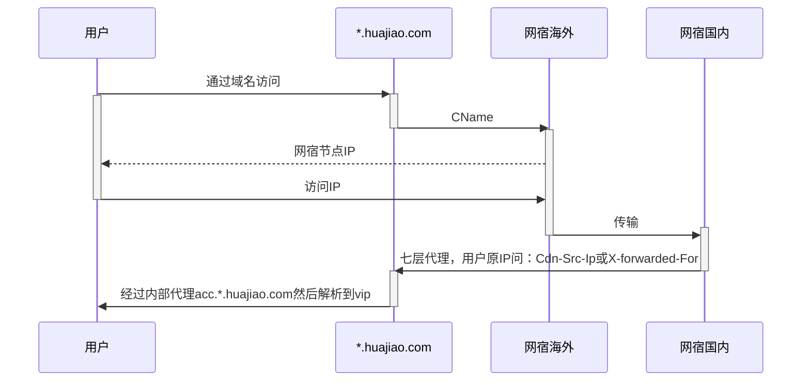

```mermaid
sequenceDiagram
	participant u as 用户
	participant h as *.huajiao.com
  participant wh as 网宿海外
  participant wg as 网宿国内
  
  
	u ->> +h : 通过域名访问
  activate u
	h ->> -wh : CName
  activate wh
  wh -->> u : 网宿节点IP
  u ->> wh : 访问IP
  deactivate u
  wh ->> + wg : 传输
  deactivate wh
  wg ->> - h : 七层代理，用户原IP问：Cdn-Src-Ip或X-forwarded-For
  activate h
  h ->> u : 经过内部代理acc.*.huajiao.com然后解析到vip
  deactivate h
```
